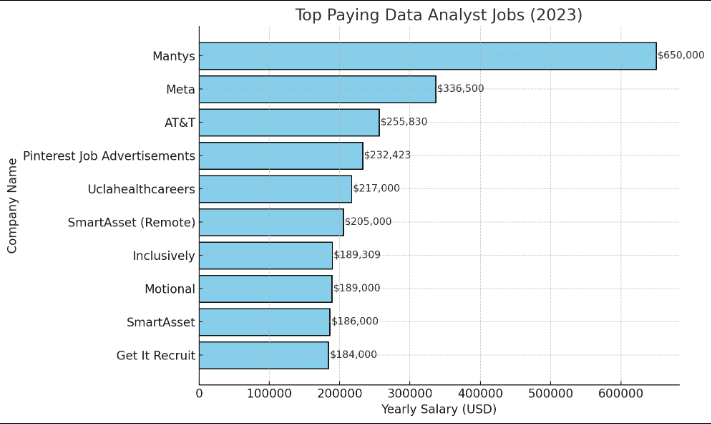

# Introduction
This project aims to dive into the data job market. Focusing on the role of a data analyst, this project explores top-paying jobs in the industry, skills that are in high demand, and valuable insights in the world of data.

The SQL queries that explore these ideas can be found here: [sql_project_queries folder](sql_project_queries/)

# The Aim of my Project

Being a recent graduate, eager to crack into the Data Analytics job market, this project was born from a desire to pinpoint highly valued and demanded skills, streamlining the process and being able to make an informed business decision based on the optimal jobs available.

The dataset used in this project is an open-source work that provides insights into job postings from all over the world from 2023. We will be diving in the remote positions for Data Analyst roles, as that is my desired position.

The questions I aim to answer through my SQL queries:

1. What are the best paying Data Analyst roles?
2. What are the skills required for these jobs?
3. What are the most in-demand skills for Data Analyst roles?
4. Which skills are associated with higher salaries?
5. What are the most optimal skills to learn in order to work in this field. (Skills that are both high-paying and highly demanded)

# Tools Used

This project has served as a learning experience for me, gaining valuable experience in working with the following tools:

- SQL: The most vital part of my project, allowing me to query the database and gain critical insights.
- PostgreSQL: The chosen database management system.
- Visual Studio Code: Used for database management and executing SQL queries.
- Git & GitHub: Essential for sharing my SQL queries and analysis.

# The Analysis

Here is how I approached each questions posed previously:

## 1. Top Paying Data Analyst Jobs

In order to identify the highest-paying roles, I filtered data analyst positions by average yearly salary and location, focusing on remote jobs. This query highlights the high paying opportunities for a Data Analyst.

```sql
SELECT
    cd.name AS "Company Name",
    jpf.job_title AS "Job Title",
    jpf.job_location AS "Job Location",
    jpf.job_schedule_type AS "Job Schedule",
    jpf.salary_year_avg AS "Yearly Salary",
    jpf.job_posted_date::DATE AS "Job Posted Date"
FROM 
    job_postings_fact AS jpf
LEFT JOIN 
    company_dim AS cd ON cd.company_id = jpf.company_id
WHERE 
    jpf.job_work_from_home = TRUE
AND 
    jpf.job_title_short = 'Data Analyst'
AND 
    jpf.salary_year_avg IS NOT NULL
ORDER BY 
    jpf.salary_year_avg DESC
LIMIT 10;
```
### Table Results

--to do

### Key Insights
Top-Paying Jobs:

**The highest salary** is offered by Mantys for the "Data Analyst" role, with an annual salary of $650,000.
This is significantly higher than the second-highest salary of $336,500 offered by Meta for the "Director of Analytics" role.
Job Titles and Salaries:

**The dataset includes** a mix of job levels ranging from standard "Data Analyst" roles to more senior titles like "Director of Analytics" and "Principal Data Analyst".
Senior roles (e.g., Director, Principal) generally cluster around the $200,000-$336,500 range, while standard analyst roles vary widely, from $184,000 to $650,000.
Companies:

**Companies like** Meta, AT&T, and Pinterest offer competitive salaries for data-related roles, primarily in senior positions.
Notably, Mantys offers an exceptionally high salary for a standard Data Analyst role, which could indicate a highly specialized or critical position.



## 2. Skills required for the top paying jobs

**Here I will be using** the previous query and building upon it, adding the skills required for these top paying jobs using CTEs.

```sql
WITH top_paying_jobs AS (
    SELECT
        cd.name,
        jpf.job_id,
        jpf.job_title,
        jpf.salary_year_avg
    FROM 
        job_postings_fact AS jpf
    LEFT JOIN 
        company_dim AS cd ON cd.company_id = jpf.company_id
    WHERE 
        jpf.job_work_from_home = TRUE
    AND 
        jpf.job_title_short = 'Data Analyst'
    AND 
        jpf.salary_year_avg IS NOT NULL
    ORDER BY 
        jpf.salary_year_avg DESC
    LIMIT 10
)

SELECT
    tpj.name AS "Company Name",
    tpj.job_title AS "Job Title",
    tpj.salary_year_avg AS "Yearly Salary",
    sd.skills AS "Skill Required"
FROM 
    top_paying_jobs AS tpj
INNER JOIN 
    skills_job_dim AS sjd ON sjd.job_id = tpj.job_id
INNER JOIN
    skills_dim AS sd ON sd.skill_id = sjd.skill_id
ORDER BY 
    tpj.salary_year_avg DESC;
```
### Table Results
-- to do

### Key Insights
Top Skills Across Roles:

- **SQL**: Essential for all roles, appearing across every job, emphasizing its importance as a foundational skill in data analytics.
- **Python**: Another frequent skill, often paired with SQL for data manipulation and analysis.
- **Tableau**: Common in roles requiring data visualization and reporting.
- **Specialized tools like**: Snowflake, Azure, AWS, and Gitlab are specific to particular roles or companies, reflecting advanced or niche technical requirements.

### Skills vs. Salary:

- **Higher-paying roles** tend to demand broader skill sets, including advanced tools and platforms like Databricks, Snowflake, and cloud solutions (e.g., AWS, Azure).
- Leadership roles (e.g., "Director, Data Analyst") list additional skills for project management and collaboration (e.g., Confluence, JIRA, SAP).

**Role Specialization**:

- Marketing Analysts (e.g., Pinterest) focus on data visualization tools (e.g., Tableau) and big data platforms (e.g., Hadoop).
- Technical Analysts (e.g., AT&T, Motional) require cloud computing and programming proficiency (e.g., Python, R, PySpark).

### 3. Most in-demand skills

This query aims to find the most demanded skills for a Data Analyst role, offering the number of job postings per skill.

```sql

SELECT
    COUNT(jpf.job_id) AS "Job Postings Per Skill",
    sd.skills AS "Skill Name"
FROM 
    job_postings_fact AS jpf
INNER JOIN
    skills_job_dim AS sjd ON sjd.job_id = jpf.job_id
INNER JOIN
    skills_dim AS sd ON sd.skill_id = sjd.skill_id
WHERE
    jpf.job_work_from_home = TRUE
AND
    jpf.job_title_short = 'Data Analyst'
GROUP BY 
    sd.skills
ORDER BY COUNT(jpf.job_id) DESC;
```
### Table Results
-- to do

### Key Observations
#### Top Skills by Job Postings:

- **SQL** is overwhelmingly the most requested skill, appearing in over 7,000 job postings, reinforcing its central role in data analysis.
- **Excel, Python, and Tableau** follow, demonstrating the importance of programming, data visualization, and spreadsheet skills.
- Advanced tools like **Power BI, R, and SAS** are also frequently requested, indicating demand for analytics and statistical expertise.


